# Supernote A6X Planner

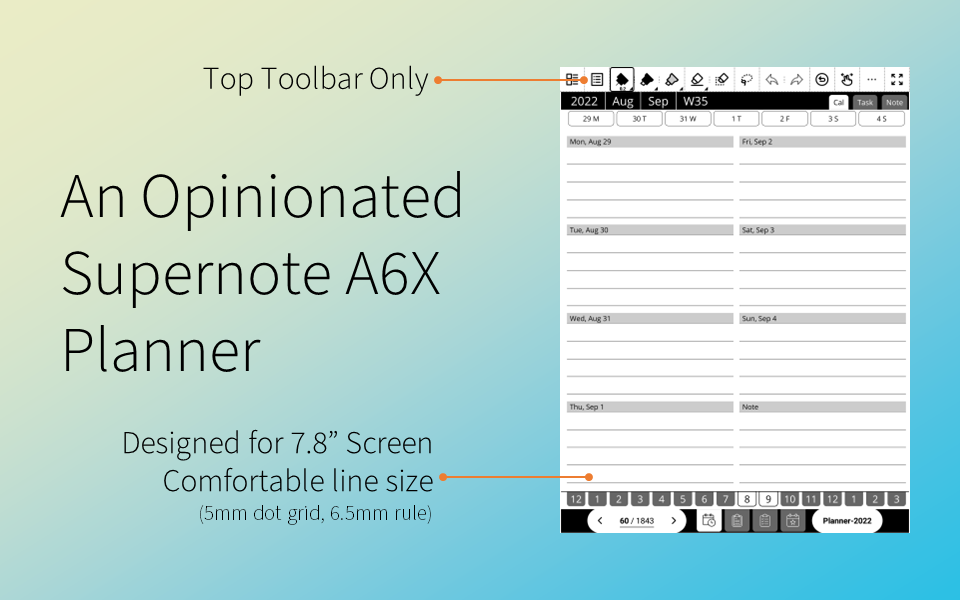
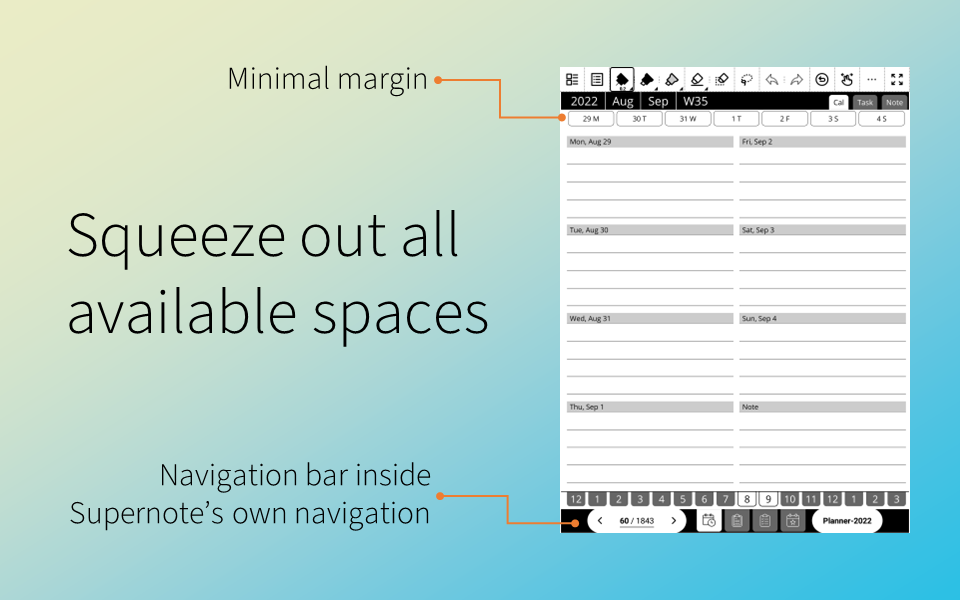
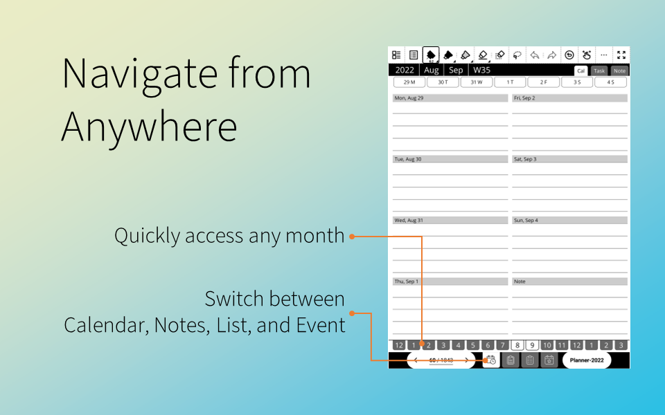

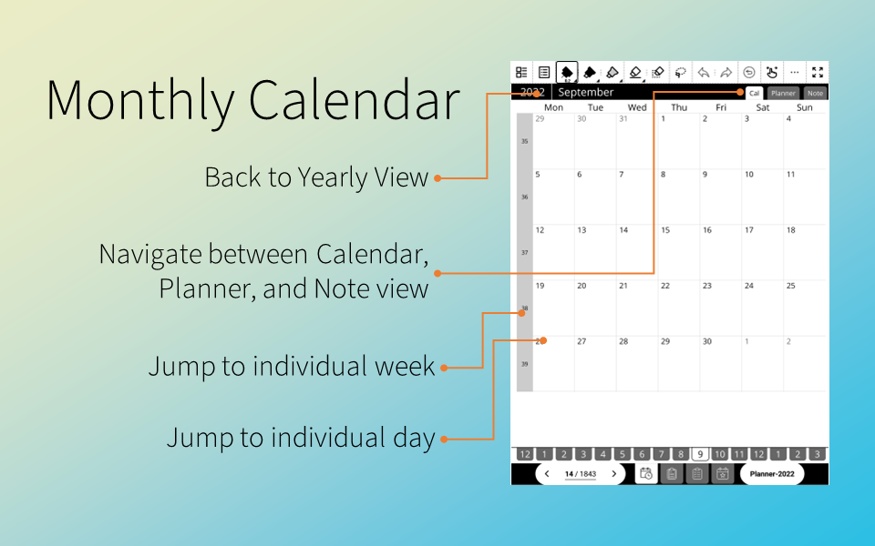
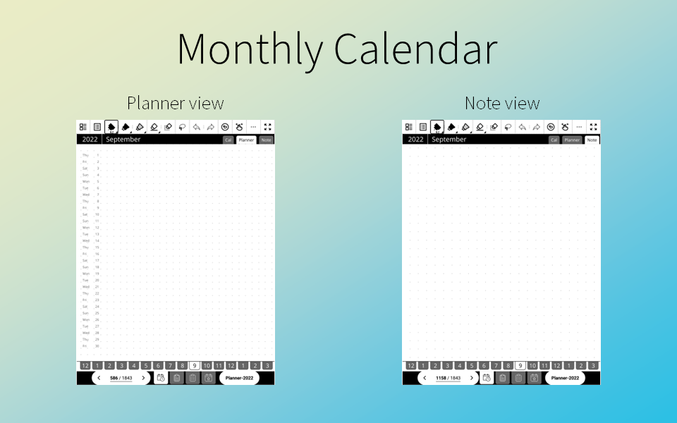
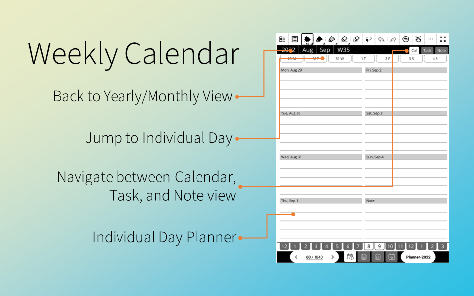
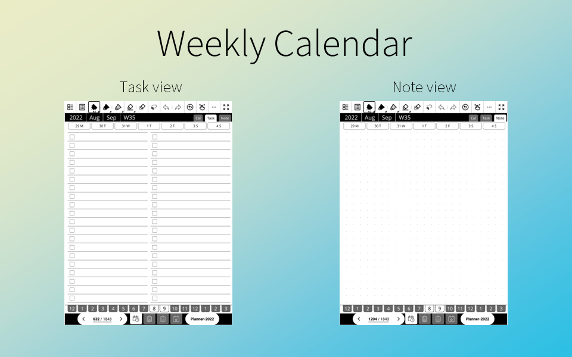
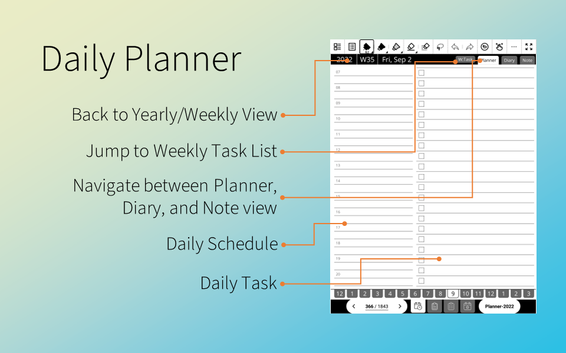
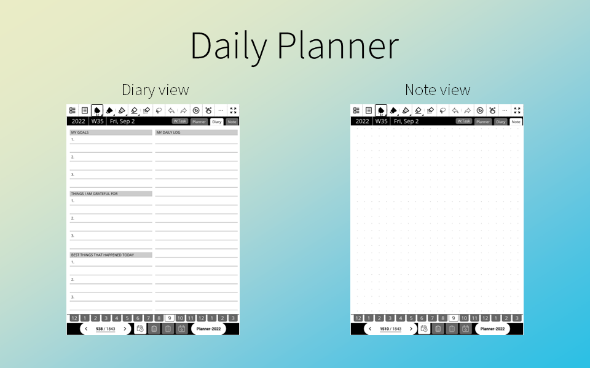
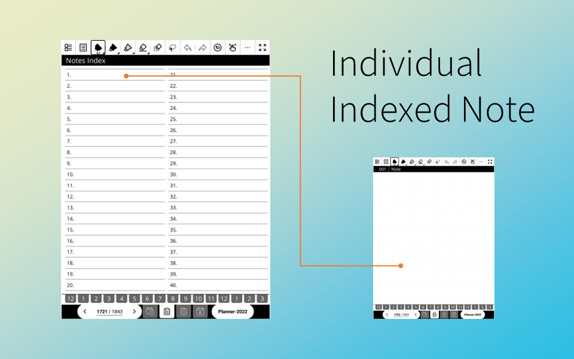
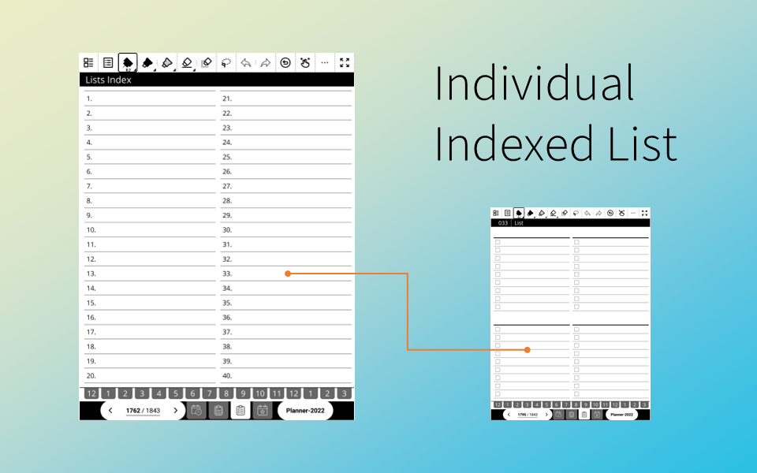
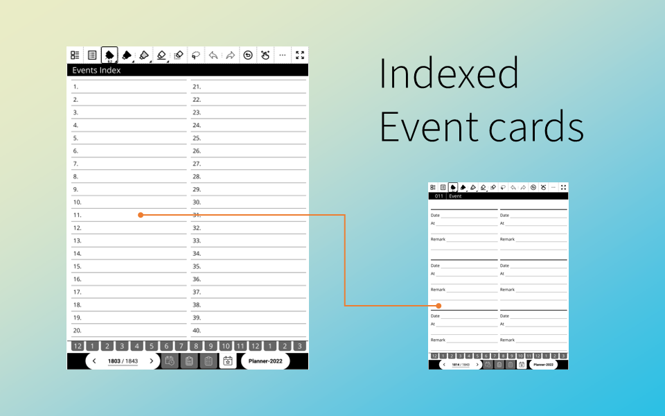

## Rationale

I just wanted a PDF Planner specifically designed for 7.8" screen
instead designed for 10.3" (A5) and scaled down. I want to be able
to use the planner without having to zoom in or out, or use the
half-page viewing feature.

I only know two A6X-specific planner, one by ePaperTemplate and
another by LinesAndDesign. The former I find it hard to use with
small link target box, and the later is still very small.

I would have love the My Daily Organiser, except it's very small
and the 2023 version is even smaller because they were designed
to handle Supernote Toolbar in all location. So my design only 
allow top toolbar.

The unique feature of this planner is the "Event" section. I
use them to keep track of local event occurring around me.
I noted down the one I might be interested, and when I have time
I just look through the list to see where I should go on my
day off.

This is revision 3 of my design, and the one
I feel is good enough to share. Enjoy.

## Building

See `make-planner.php` and `build.php` for other configurations.
More common configurations are available in Release section.

## License

The code and planner file are licensed under AGPL-3.0 license.

## Attribution

The icon in the planner has been designed using resources from Flaticon.com
